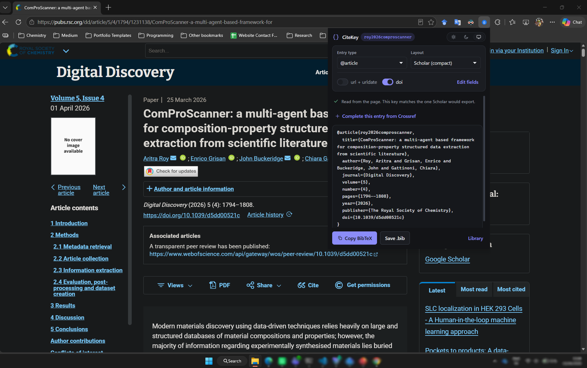

# CiteKey

A Chrome (MV3) extension that generates a BibTeX entry for whatever article page you are on, using **the same citation key Google Scholar would produce**. Import the same paper from both Scholar and this extension and your reference manager flags the duplicate instead of silently storing it twice.



It also renders `@online` entries in the layout used for web sources:

```bibtex
@online{google2023what,
  author = {{Google Cloud.}},
  title = {What Is Artificial Intelligence (AI)?},
  year = {2023},
  url = {https://cloud.google.com/learn/what-is-artificial-intelligence},
  urldate = {2024-09-25}
}
```

No account, no analytics, no server. See [PRIVACY.md](PRIVACY.md).

If CiteKey saves you some typing, **star the repo** — and if it misreads a page, [open an issue](https://github.com/aritraroy24/citekey/issues) with the URL. Publisher markup is the whole ball game here, and every page you report becomes a test fixture.

## Install

**From source:**

1. Open `chrome://extensions`.
2. Turn on **Developer mode**.
3. Click **Load unpacked** and select this folder.

Works the same in Edge, Brave and any other Chromium browser. `npm run package` builds the Web Store upload zip in `dist/`.

## Use

Open an article page and click the toolbar button, or press **Alt+B** (rebindable at `chrome://extensions/shortcuts`). The popup reads the page's metadata, shows the finished entry, and offers **Copy BibTeX** or **Save .bib**.

- **Entry type** — `@article` when the page declares a journal, `@inproceedings` for conference papers, `@online` otherwise. Override it at any time; `doi` is off by default and `url` + `urldate` follow the entry type.
- **Layout** — *Scholar (compact)* writes `title={…}` in Scholar's own field order, so a diff against a Scholar export is near-empty. *Spaced* writes `author = {…}`, matching the `@online` example above.
- **Your choices stick.** Entry type, layout and both toggles are remembered across sessions, so a "always `@online`, always spaced" workflow is set once. Defaults live on the library page.
- **Edit fields** — opens every field for correction, including the citation key. The key recomputes as you edit the author, title, or year, until you type in the key box yourself. Fields open automatically when a page has no proper citation metadata.
- **Complete from Crossref** — appears when the entry has a DOI. Fetches the authoritative record (authors, journal, volume, issue, pages, year) and merges it in, which is what rescues PDF viewers and older journal pages. Chrome asks for permission the first time; the extension is fully usable without it.
- **Duplicate warning** — every key you copy or save is remembered locally. If that key later comes up for a *different* page, a warning names the earlier page and date. Copying the same page again — after switching entry type or layout, say — says nothing.
- **Library** — the button in the footer opens a page listing everything you have copied, searchable, with per-entry copy/delete and **Export all as .bib**.
- **Theme** — light, dark, or follow the system, from the control in the top right of either page. The default follows your system, and the choice is applied before the popup paints, so there is no flash of the wrong palette.
- **PDFs** — when the tab is a PDF there are no citation tags to read, so CiteKey reads the file instead. Click **Read the PDF** and it parses the first pages (1–5, your choice); **Open a file…** does the same for a PDF on your disk. See below for how much it can work out.
- **Height** — the popup grows to fit its entry, so a typical one needs no scrolling at all. Chrome hard-caps a popup at 600px; past that only the middle section scrolls, keeping the controls and the Copy button in place.

## How the citation key is built

`firstAuthorSurname` + `year` + `firstSignificantTitleWord`, lowercased and reduced to ASCII alphanumerics — for example `lecun2015deep`, `van2008visualizing`, `google2023what`.

- The surname contributes only its **first whitespace token**, which is why "Laurens van der Maaten" keys as `van…`, exactly as Scholar does it.
- Accents fold to ASCII (`Müller` → `muller`), digits survive (`3D` → `3d`), everything else is dropped.
- The title word is the first word that is not one of: *a, an, the, on, of, in, into, for, from, to, with, at, by, as, and, or, nor, is, are, was, were, be, been, being, over, under, about*. Only leading ones are skipped — "Attention is all you need" keys as `attention`, "Is Google making us stupid?" as `google`.
- A corporate author keys on its first word, so `{Google Cloud.}` gives `google`.

If the page has no year, the key is author + title word and **will not match Scholar's** — the popup warns when this happens.

## Where the metadata comes from

Read in order of reliability, first hit wins per field:

1. **Highwire Press** `citation_*` tags — Elsevier, Springer, Wiley, Taylor & Francis, SAGE, IEEE, PubMed Central, arXiv, most OJS journals.
2. **bepress** `bepress_citation_*` and `eprints.*` — institutional repositories.
3. **PRISM** `prism.*` and **Dublin Core** `dc.*` / `dcterms.*`.
4. **schema.org JSON-LD** (`ScholarlyArticle`, `Article`, `NewsArticle`, `WebPage`, …).
5. **Open Graph** / `<h1>` / `<title>`, plus a DOI sniffed out of the page text.

**GitHub** — on `github.com` repositories and `*.github.io` pages the owner is the author (`author = {{slimeslab}}`) and the `owner/` prefix is dropped from the title, so `slimeslab/ComProScanner: A python package…` becomes `ComProScanner: A python package…`. The year comes from the newest date GitHub renders on the page. A page carrying proper `citation_*` tags overrides all of this.

## Reading a PDF

A publisher's article page hands over clean metadata. A PDF hands over almost nothing, so CiteKey works down three sources:

1. **XMP** — publisher-typeset PDFs embed `dc:title`, `dc:creator` and `prism:*`. Reliable; the popup says so.
2. **The info dictionary** — usually present, frequently junk ("Microsoft Word - draft3.doc"), so it is sanity-checked before use.
3. **The page layout** — LaTeX PDFs, which is most preprints and many conference papers, carry no metadata at all. There the title is the largest run of text near the top of page one, the authors are the lines beneath it, and the venue comes from the boilerplate publishers print on the first page.

On top of that:

- **Entry type** is inferred — conference proceedings, journal article, preprint or book — from venue boilerplate, an ISBN, or an arXiv stamp.
- **arXiv is cited as arXiv.** A preprint gets the entry arXiv itself provides — `@misc` with `eprint`, `archivePrefix` and `primaryClass` — with no journal, volume or pages, even when the PDF's own footnote names the conference the work later appeared at. You read the preprint; the entry says so. The same applies on an `arxiv.org/abs/` page.
- **The year comes from the identifier**, not the stamp: `1706.03762` was first posted in June 2017, even on a copy stamped 2023 because it was revised.
- **The journal comes from the running head**, the one place a journal prints its name on every page.
- **A DOI found anywhere in the file** short-circuits all of it: Crossref then settles the record authoritatively.
- **No DOI?** *Find this paper on Crossref* searches by title and author, and shows you what it found before applying it — a title search is a guess, not an identity, and it is capable of matching a repost from a different year.

The popup says which of these it used, and how much to trust the result. Anything guessed is editable before you copy.

How the file is read: from inside the tab, so PDFs behind a bot check or a login work — the browser already has the cookies and the cached file. If the viewer blocks that, use **Open a file…**, which always works and needs no permissions.

Author names are normalised to `Last, First`, with name particles (van, von, de, del, …) kept with the surname and PubMed-style trailing initials (`Okafor CN`) understood as such. Names that look like organisations get the double braces BibTeX needs (`{{Google Cloud.}}`) so they are never reordered or abbreviated.

## Permissions

| Permission | Why |
| --- | --- |
| `activeTab` | Read the metadata of the page you clicked the button on — and only then. |
| `scripting` | Inject the metadata reader into that tab. No content script runs automatically anywhere. |
| `storage` | Remember your preferences and the entries you copied, on your device. |
| `https://api.crossref.org/*` | **Optional.** Requested the first time you use the Crossref lookup; never at install. |

## Development

```bash
npm install       # jsdom and puppeteer-core, both dev-only
npm test          # 54 tests
npm run preview   # render both pages in Chrome with fixture data -> dist/preview
npm run package   # build the Web Store zip -> dist
```

`npm run preview` drives the Chrome already on your machine (set `CHROME_PATH` if it is somewhere unusual), serving the pages over localhost with the `chrome.*` APIs stubbed. It is how the UI gets checked in both themes without installing the extension, and it stages the store screenshots.

The suite pins the key algorithm against known Scholar keys, pins both output layouts byte for byte, runs the real extractor against jsdom fixtures for Highwire, JSON-LD-only, GitHub, PubMed, arXiv, IEEE/PRISM, Dublin Core and empty pages, runs the PDF heuristics against structures captured from four real PDFs (`scripts/pdf-fixture.mjs` captures more), and guards the things a Web Store review would bounce (missing files, over-long listing text, unjustified permissions). `node_modules` is not part of the extension — only `manifest.json`, `src/`, `icons/` and `_locales/` are packaged.

| File | Role |
| --- | --- |
| [manifest.json](manifest.json) | MV3 manifest |
| [src/extract.js](src/extract.js) | injected into the page; returns one metadata record |
| [src/bibtex.js](src/bibtex.js) | key generation, escaping, entry rendering |
| [src/entry.js](src/entry.js) | shared pure helpers: authors, settings, library |
| [src/crossref.js](src/crossref.js) | DOI lookup, title search, record merging |
| [src/pdfread.js](src/pdfread.js) | pdf.js wrapper: PDF bytes to lines, cells and metadata |
| [src/pdfmeta.js](src/pdfmeta.js) | what a PDF is: title, authors, venue, type, confidence |
| [src/pdfsource.js](src/pdfsource.js) | getting the bytes of the PDF in the tab |
| [src/popup.*](src/popup.js) | the popup |
| [src/library.*](src/library.js) | saved entries and preferences |
| [src/theme.css](src/theme.css), [src/theme.js](src/theme.js) | design tokens, shared components, pre-paint theme |
| [scripts/preview.mjs](scripts/preview.mjs) | renders both pages in Chrome for review |
| [scripts/package.mjs](scripts/package.mjs) | builds the Web Store zip |
| [STORE.md](STORE.md) | listing copy, permission justifications, submission checklist |

## Feedback

Issues and pull requests are welcome at <https://github.com/aritraroy24/citekey>. The most useful report is simply a URL the extension got wrong, together with what the entry should have said — that pins down a fixture and a fix in one go. And a star helps other people writing bibliographies find it.

## Licence

MIT — see [LICENSE](LICENSE).

PDF reading uses [pdf.js](https://github.com/mozilla/pdf.js), vendored under [src/vendor/](src/vendor/) because an extension cannot load code from a CDN. It is Apache-2.0 and unmodified; its licence travels with it.
